# 大学生心理健康状况动态监测与预警系统 — 架构图

---

## 一、ER 图（实体关系图）

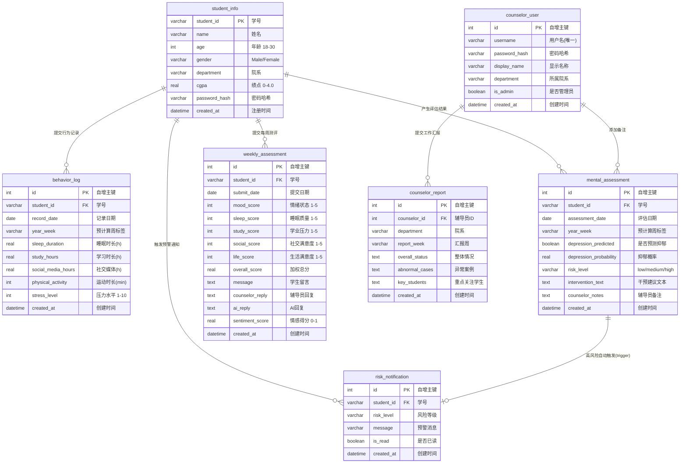

### 预聚合表（运行时生成，不存储原始数据）

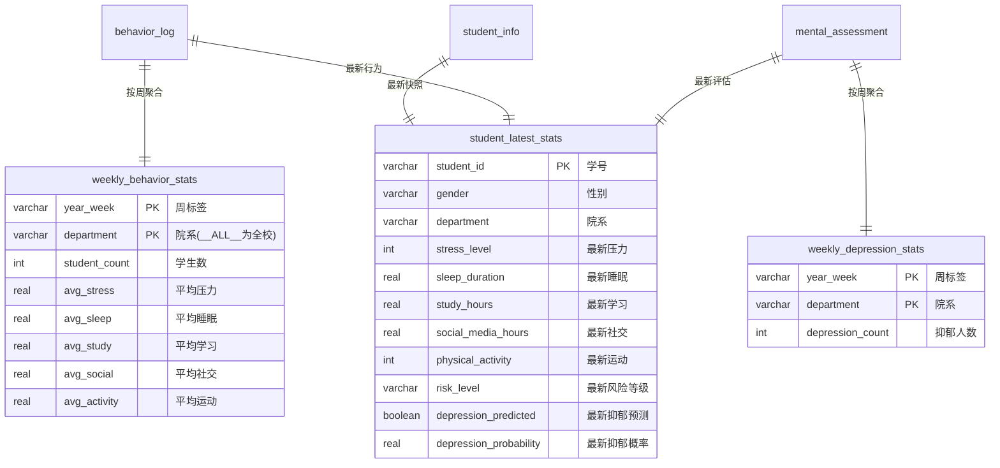

### 视图

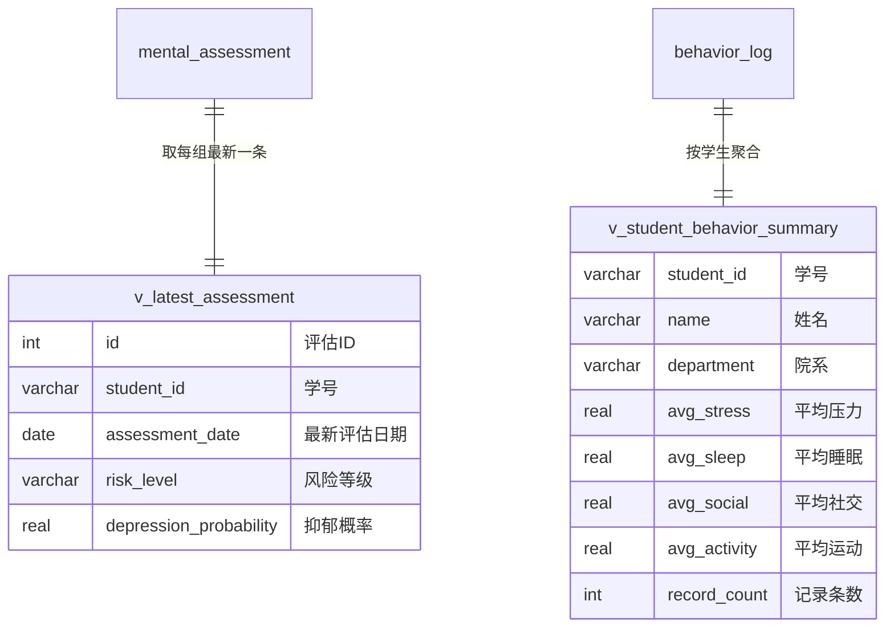

---

## 二、泳道图（系统交互流程）

### 2.1 用户登录流程

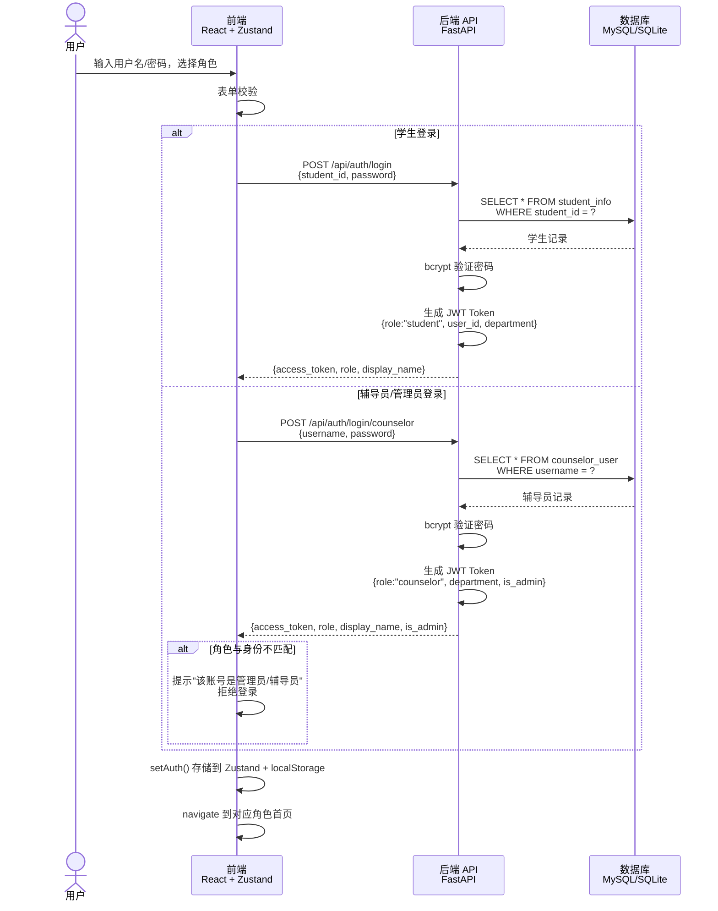

### 2.2 学生提交每周测评 + NLP 分析流程

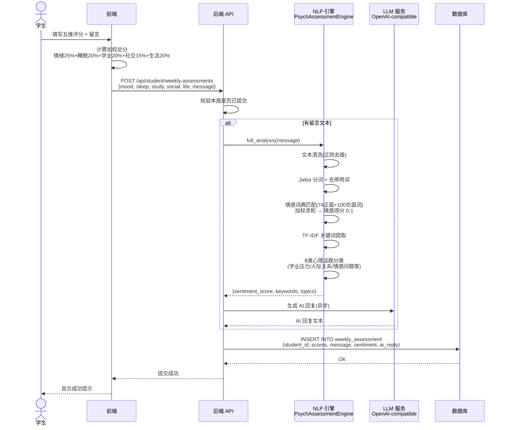

### 2.3 辅导员查看群体画像 + 聚类分析流程

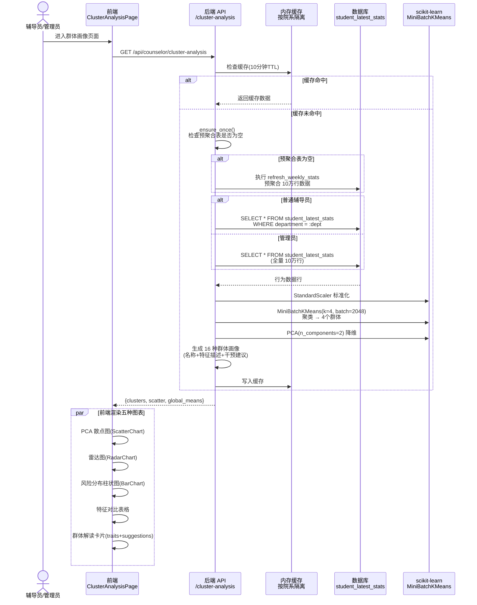

### 2.4 ML 模型训练与批量评估流程

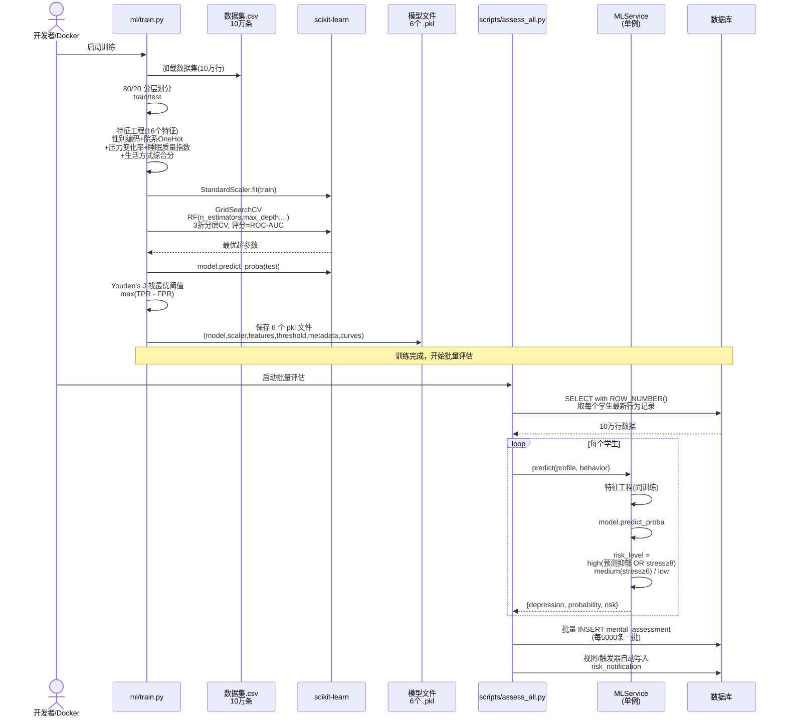

### 2.5 统计检验流程（T检验/卡方/相关性）

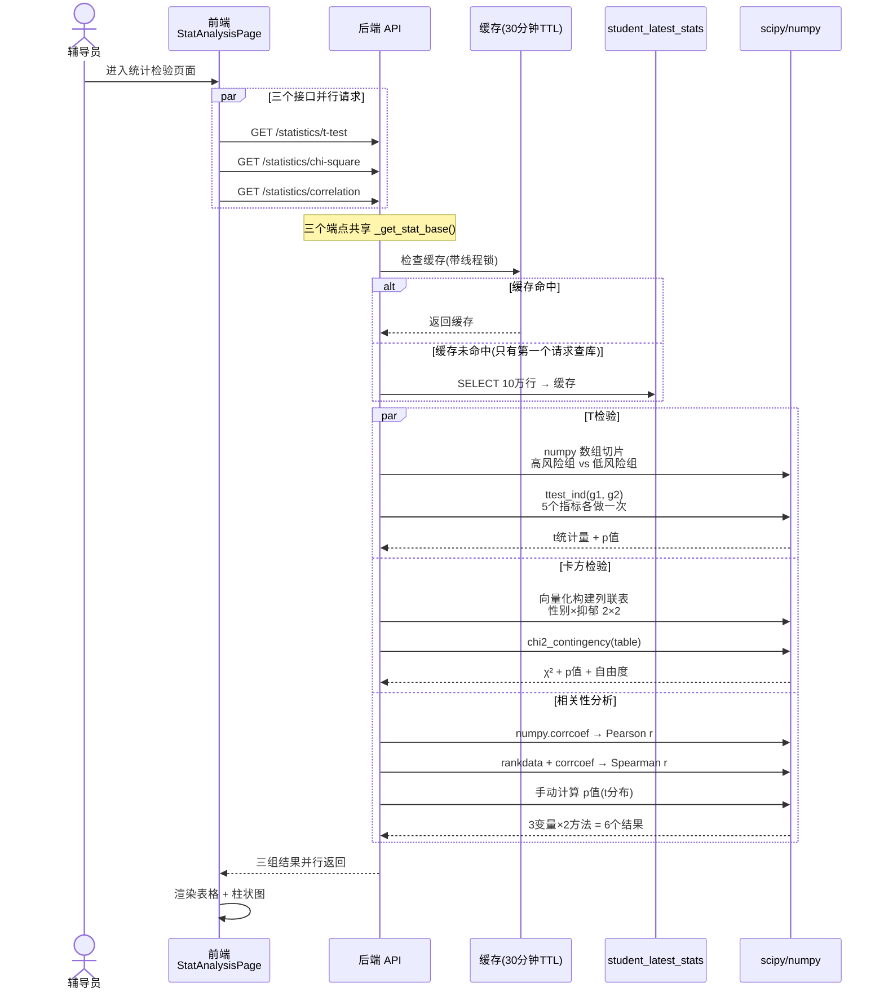

### 2.6 预警触发与辅导员干预流程

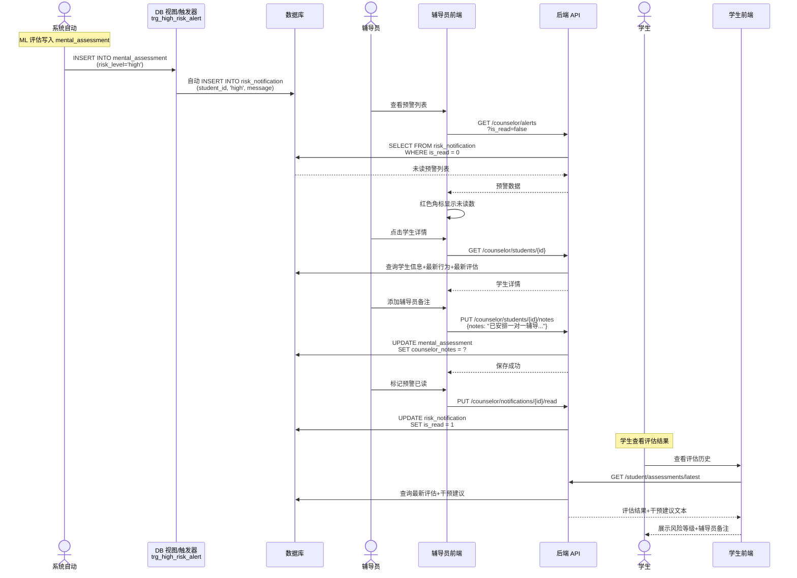

### 2.7 Docker 一键部署流程

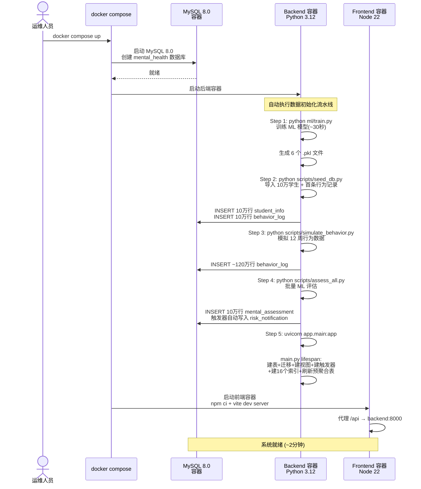

---

## 三、系统架构总览

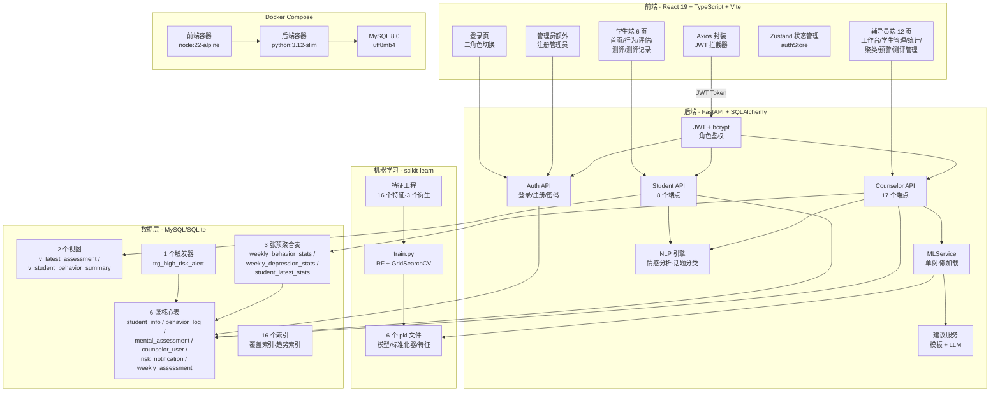
